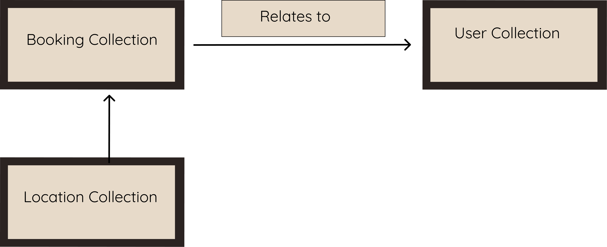
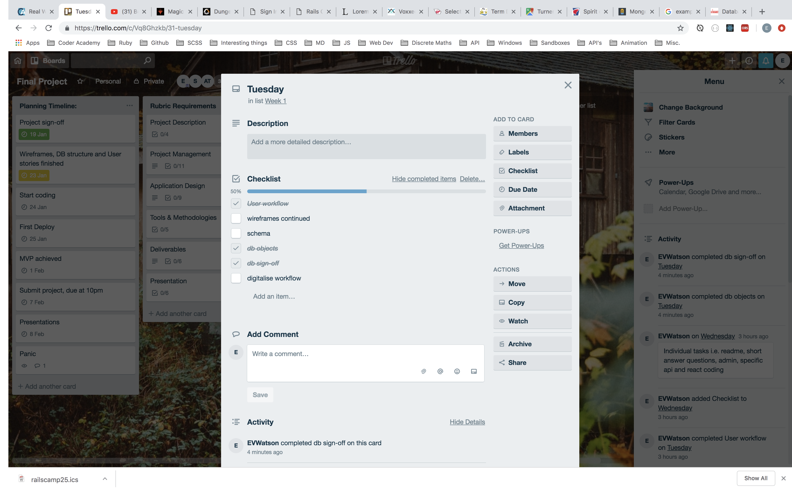
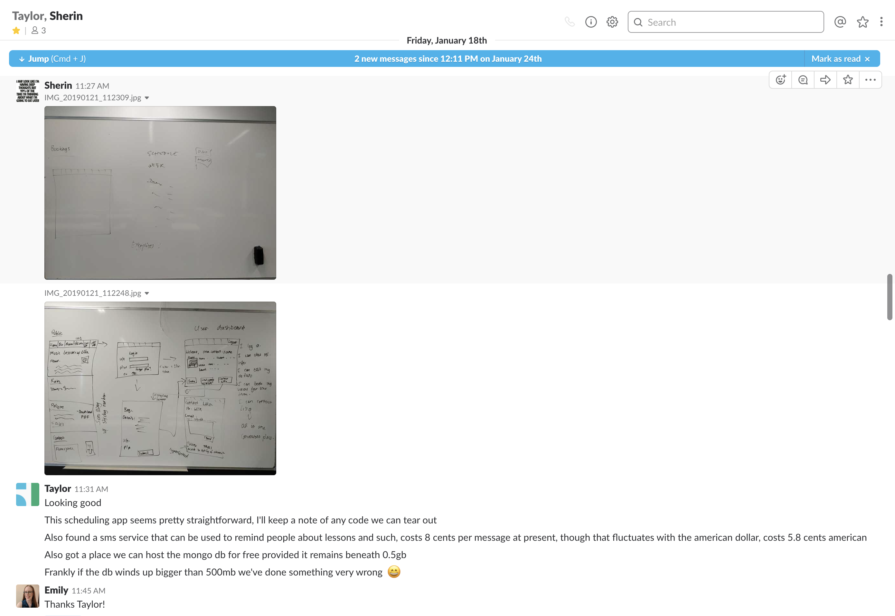

# Real World Application

Team members:
- Sherin Samuel
- Alex Taylor
- Emily Watson


View our application here: [Music Lessons With Lilla](https://lms-lilla.netlify.com/).

View the GitHub repository [here](https://github.com/EVWatson/Final-Project).

## Our Client
Our client is Lilla, a self-employed, instrumental music teacher.


## Project Description

### Problem definition / purpose:

Lilla currently uses Facebook, business cards and flyers as a means to display information relevant to her teaching business. Students currently call or email Lilla to make enquiries and bookings for lessons. Lilla currently calls, emails or texts students to send invoices, and remind them of lesson times.

Lilla would like a centralised place to consolidate all of these processes. She would especially like a means of keeping student details accurate and up to date. She would also like a means to remind parents of lesson times, exceptions to lesson times such as public holidays, and when invoices are due for payment.

For her student's parents, Lilla would like a means for them to make bookings, view current bookings, and update their contact details.


### Functionality and Features

Screenshots of Application:


Tech stack:

This application uses a MERN stack; MongoDB for our database, Express as the framework for the API, ReactJS for the front-end, and Node.js for running the server environment.

Our application is deployed to the following:
 * React - Netlify
 * API - now.sh
 * MongoDB - mLab


### Setup and Configuration

1. Fork or clone the repository to your local computer.

2. Run ``` $ npm i ``` to install dependencies.

To run on your local computer:

1. Set up .env file in your api directory; you will need to include your MongoDB, Cookie and Request Origin secret keys in this file. You will need to add the .env file to your gitignore.

2. In the client directory, you will need to create a .env.development file with REACT_APP_API_URL=you_local_host_address. Alternatively, you can go through the client files and update
```JavaScript
 const url = process.env.REACT_APP_API_URL + `/pathname`
 ```
 to your localhost address, i.e. :
 ```JavaScript
 const url = 'http://localhost:3000/pathname'
 ```

2. In the project directory, run ``` $ mongod ``` to start your local MongoDB server.

3. Run the seed file (api/users.json) or see the JSON object structure (located in this README) to populate your database.

4. In the api directory, run ``` $ npm start ``` to start your api server.

5. In the client directory, run ``` $ npm start ``` to start the React local server; React scripts will automatically open the web application in you default browser.

Ports used:
- MongoDB: default set by mongod,
- API: 5001,
- React: 3000

### App Deployment and Usage

To deploy the application:

Our application is deployed to free hosting services. We recommend deploying the database to [mLab](https://mlab.com/welcome/), API to [now.sh](https://zeit.co/now), and React to [Netlify](https://www.netlify.com/).

1. Sign up for each of the services listed above (or a service of your own choice).

2. Deploy the database to mLab following the [docs](https://docs.mlab.com/). Make sure you update your .env file so the database url matches your deployment url (supplied by mLab), rather than your local mongod server address.

3. Deploy the API to now.sh following the [docs](https://zeit.co/docs). The url provided by now.sh should show 'hi from api' in the browser. You can test other endpoints using Postman or a similar program.

4. Deploy React to Netlify following the [docs](https://www.netlify.com/docs/).

You can now view the deployed application at the url provided by Netlify. For any changes made to the code after deployment, you will need to re-deploy the API and React to view them at the application url.


# Design Documentation

### Design process

Our design process began with white-boarding the data structure. Once this was established, we used the colour scheme and typography from our client's business card as inspiration for the design of the website and application. The wireframe and user workflow layout was then created in Figma.


### User stories

**Teacher (admin user)**

The teacher has a user role of admin. When logged in, the teacher is directed to their dashboard portal, where they can view their schedule for the week, which shows booked music lessons, so they can plan their day.

The teacher can navigate to site details from their admin dashboard to update the website content, i.e. to update lesson prices or policies.

The teacher can navigate to student detail from their admin dashboard so they can find the contact details of a group of students or a particular student.


**Parent/student (user)**

The parent has a role of user. When logged in, the parent is directed to their dashboard portal. From here, the parent can view their current enrolment details, including lesson day, time and location.

The parent can navigate to their contact details from the user dashboard to view what details they have provided, and update their details when necessary.

The parent can navigate to lesson bookings from the user dashboard, where they can book a lesson day and time for the upcoming term that fits in with their availability.

**Website visitor/prospective student**

A visitor to the website has public access only.

A visitor can view information about Lilla and the music tuition services she provides on the Home page to find out more about her as a prospective teacher.

A visitor can view specific information about Lilla's music lessons, including instruments offered, teaching locations, and rates and payment on the Lessons page. They can also view Lilla's lesson policies on the Polcies page. The visitor can use this information to make an informed decision as to whether they would like to book lessons with Lilla.

A visitor can visit the Contact page to view contact details for Lilla, so they can get in touch with further enquiries.

A visitor can view the Login page, and select 'Register' to create a user account once they have decided to enrol themselves or their child into lessons with Lilla.


### User Workflow Diagram and Wireframes.

**Workflow:**


**Wireframes:**


**Database Entity Relationship Diagrams**



Example of mongoose schema for Booking Collection:

```JavaScript
const bookingSchema = new schema({
      day: String,
      location: String,
      time: String,
      duration:  Number,
      instrument: String,
      booked_by: {type: mongoose.Schema.Types.ObjectId, ref: 'user'},
})
```
Example of filled-out mongoose schema for Booking Collection:

```JSON
{
      "day": "Monday",
      "location": "Super Awesome Primary School",
      "time": "0900",
      "duration":  "30 mins",
      "instrument": "Piano",
      "booked_by": {"type": "mongoose.Schema.Types.ObjectId", "ref": "user"},
}
```
### OO Design


# Details of Project Management & Planning process including:

### Project plan & timeline

_**Week One**_
- data planning and structure
- mongoDB objects created
- begin coding by mid-Week
- deploy database

_**Week Two**_
- continue coding, focussing on authentication and user api end points
- begin react, routing current user end-points
- style as we go
- continue documentation
- complete Wireframes, which will double as a user workflow
- deploy API

_**Week Three**__
- finish functionality
- deploy front end
- finish README
- obtain feedback from Lilla
- submit

### Client Communications

Please see directory of client communications submitted with project.

### Trello board






### Source Control Process

Our group used github and it's branch functionality for source control. Each member of the group would make changes to the code in their own local copy of the code on a branch, with an appropriate name, before pushing to github from said branch. They would then make a pull request and using slack or a verbal request, ask another member of the group to merge the pull request ensuring that any changes were authorized by a minimum two members. Coding in this manner ensured that if we had any major errors we knew where they came from, when they occurred and at worst we could use the internal github repository ability to roll back to before a pull request was merged, allowing us to "re-wind" to before an error occurred.

### Testing Log


# Short Answer Questions

1. What are the most important aspects of quality software?

  The most important aspects of quality software are:
  - reliability; does it perform the job properly each and every time?
  - efficiency; does it take a long time to perform simple calculations or does the program work to a level of speed that isn't detrimental to work flow?
  - security; how well does the program defend against potential intrusion or data breaches?
  - usability; is the program easy to use and well designed, with a minimal amount of time needed to learn how to use it.

2. What libraries are being used in the app and why?

  The libraries used in this project are ReactJS, Axios, React-Router-Dom, Express, Passport, CookieSession, Bcrypt, Mongoose and Cors. ReactJS was a project requirement, Axios a more efficient way to manage requests to the API than fetch, React-Router-Dom for efficient routing in the front-end, Express for building the API, Passport and CookieSession for authentication, Bcrypt for hashing passwords, Mongoose for easier interface with MongoDB, and Cors to bypass the default browser setting that blocks access from other sources such as API's/browsers.

3. A team is about to engage in a project, developing a website for a small business. What knowledge and skills would they need in order to develop the project?

  The team in question would need a knowledge of the tech stacks required, be they plain HTML & CSS, JavaScript, Python, Ruby/Rails, or any number of other technologies that could be used for website construction. They would also need to know their teammate's strengths and weaknesses in order to assign appropriate tasks to appropriate people, as well as assist each other in learning new skills. They would also need a knowledge of Github, BitBucket or something similar in order to work effectively as a team and employ Agile methodology. Finally, they would require the ability to willing seek out answers to problems that arise that are outside the group's knowledge. The ability to negotiate with their client, managing expectations and meeting requirements is also invaluable, as is the ability to negotiate and work effectively and professionally as a team.

4. Within your own project what knowledge or skills were required to complete your project, and overcome challenges?

  In our project a knowledge of HTML, CSS, JavaScript, React, MongoDB and GitHub were required. A knowledge of where our teams strengths and weaknesses lay was also helpful for appropriate division of labour, and for creating learning and teaching opportunities between team-members. High level soft skills in negotiation and communication were also required to overcome challenges in code, data structure, and the logistics of mob-programming, pair-programming, and individual work. Finally an above average skill in google-fu was required to solve problems with code that we had theretofore not experienced.


5. Evaluate how effective your knowledge and skills were this project, using examples, and suggest changes or improvements for future projects of a similar nature?

  There were a wide variety of skills and strengths within our group, with some members more confident in their knowledge and abilities than others. This meant that while not all areas of the project could be divided into three equal parts for individual work, many teaching and learning opportunities were created. In terms of the basic set-up of React, MongoDB and Express, all members of the team were very capable. The process of working out how to implement more advanced features, particularly scheduling, proved a challenge. Our team were able to visualise how we wanted the end-product to look, but had a lot to learn in terms of how to implement this in code. With many differences of opinion, soft skills were very effective in navigating our way to mutually agreeable decisions.

  For future projects, our team will now have a better idea of managing time and adjusting our MVP to a more realistic level for the time allocated to the project. Time was also a particular concern as we were a 3, rather than 4, member team, and as such the work load was heavier. Each of us has learned a lot from the project, and progressed in a number of areas. This progression of skills would also be beneficial to future projects, as we may find we can be more ambitious with what we would like to achieve.
